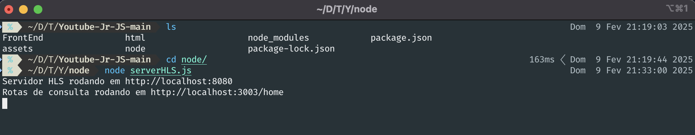

Para utilizar este repositório Youtube-Junior, siga as instruções abaixo:

1.  **Descrição do Projeto:**

    *   O projeto foi implementado para a disciplina de Sistemas Distribuídos. Ele simula um sistema de streaming de vídeo similar ao YouTube, utilizando HLS (HTTP Live Streaming) para entregar o conteúdo.

2.  **Dependências:**

    Requisitos
    	Node versão 23.7.0
    	Navegador (Chrome, Microsoft Edge, Mozila Firefox, etc)

    Baixe o Node js na versão 23.7.0 https://nodejs.org/pt/download

    *   As dependências do projeto estão listadas no arquivo `package.json`. Para instalá-las, execute o seguinte comando na raiz do repositório:

        ```bash
        npm i
        ```

        As dependências incluem:

        *   `cors`: Para habilitar o compartilhamento de recursos entre origens diferentes (CORS).
        *   `express`: Para criar o servidor web.
        *   `fluent-ffmpeg`: Para realizar a conversão de vídeos para o formato HLS.
        *   `hls-server`: Para servir os vídeos no formato HLS.

3.  **Estrutura de Arquivos e Funções:**

    *   `node/produceStream.js`: Este script é responsável por converter os vídeos MP4 localizados na pasta `assets/mp4` para o formato HLS (m3u8 e segmentos .ts) e salvá-los na pasta `assets/output`. Ele utiliza o `fluent-ffmpeg` para realizar a conversão.
    *   `node/serverHLS.js`: Este script configura um servidor HTTP utilizando `express` e um servidor HLS utilizando `hls-server`. Ele serve os arquivos HLS (m3u8) localizados na pasta `assets/output` através da rota `/streams`. Além disso, ele também serve a página HTML (`FrontEnd/index.html`) que consome o servidor HLS, permitindo a visualização dos vídeos em um navegador. Este arquivo também define algumas rotas como:

        *   `/home`: serving the main page (`FrontEnd/index.html`).
        *   `/videos`: serving the `videosList.json` file containing the videos list
        *   `/styles/mediaPlayerStyle`: serving the css style for the video player (`html/mediaPlayerStyle.css`)
        *   `/styles/favicon`: serving the favicon (`FrontEnd/img/yt_ico_32x32.png`)
    *   `FrontEnd/index.html`: Esta é a página HTML principal que contém a interface do usuário do "YouTube Jr.". Ela exibe uma lista de vídeos e um player de vídeo que consome o servidor HLS para reproduzir os vídeos.
    *   `FrontEnd/videosList.json`: Arquivo JSON que contém os metadados dos vídeos (título, nome do canal, visualizações, etc.) e as rotas para os vídeos HLS.
    *   `html/index.html`: Player de vídeo HLS.

4.  **Configuração e Execução:**

    1.  **Converter Vídeos:**

        *   Coloque os vídeos MP4 que você deseja transmitir na pasta `assets/mp4`.
        *   Execute o script `node/produceStream.js` para converter os vídeos para o formato HLS:

        ```bash
        node node/produceStream.js
        ```

        *   Este script irá gerar os arquivos `.m3u8` e os segmentos `.ts` correspondentes na pasta `assets/output`.
        
    2.  **Iniciar o Servidor HLS:**

        *   Execute o script `node/serverHLS.js` para iniciar o servidor HTTP e o servidor HLS:

        ```bash
        node node/serverHLS.js
        ```

        *   O servidor HLS será iniciado na porta 8080 e o servidor de rotas na porta 3003.
        
            
        
    3.  **Acessar a Aplicação:**

        *   Abra um navegador web e acesse a página inicial da aplicação no seguinte endereço: `http://localhost:3003/home`.
        *   Você deverá ver a interface do "YouTube Jr." com a lista de vídeos disponíveis.
        *   Clique em um vídeo para reproduzi-lo. O player de vídeo irá consumir o servidor HLS para exibir o vídeo.

5.  **Considerações Adicionais:**

    *   Certifique-se de que os caminhos dos arquivos e diretórios estejam corretos nos scripts `produceStream.js` e `serverHLS.js`.
    *   O arquivo `videosList.json` contém as informações dos vídeos exibidos na página inicial. Você pode modificar este arquivo para adicionar ou remover vídeos da lista.
    *   O script `produceStream.js` utiliza o `fluent-ffmpeg` para realizar a conversão dos vídeos. Certifique-se de ter o FFmpeg instalado no seu sistema e configurado corretamente.
    *   O servidor HLS serve os vídeos através da rota `/streams`. Certifique-se de que esta rota esteja configurada corretamente no player de vídeo na página HTML.
    *   O projeto utiliza as portas 8080 e 3003 para o servidor HLS e para as rotas de consulta, respectivamente. Certifique-se de que estas portas estejam disponíveis no seu sistema.

6. **Modificações:**

    *   Para adicionar novos vídeos, coloque os arquivos `.mp4` na pasta `assets/mp4`, rode o script `node produceStream.js` para gerar os arquivos `.m3u8` e `.ts`.
    *   Edite o arquivo `FrontEnd/videosList.json` para adicionar as informações do novo vídeo, como título, nome do canal, thumbnail, etc. O campo `video_route` deve apontar para a rota do vídeo no servidor HLS (e.g., `http://localhost:8080?video=nome_do_video.m3u8`).

7.  **Visualizar um vídeo:**

    *   Para visualizar um vídeo específico, modifique a url base `http://localhost:3003/home` para `http://localhost:3003/html/index.html?video=nome_do_video.m3u8`.

Seguindo estas instruções, você deverá ser capaz de utilizar o repositório Youtube-Junior para criar um sistema de streaming de vídeo simples.
